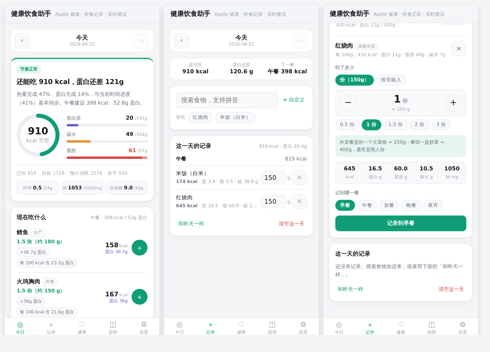

# 健康饮食助手

当前版本：**v2.11.1**（统一动作标签、趋势空状态与卡片说明入口）

同步 Apple 健康数据 + 记录每日饮食 → 按你的身体信息实时判断热量与蛋白摄入，
并根据**此刻剩余的预算**给出「现在该吃什么」和「现在别碰什么」。

纯静态、零构建。默认本地模式下，健康与饮食数据只存在你自己的浏览器里（IndexedDB）；
站点配置 Supabase 后，可选择邮箱密码或 Google 登录，把数据同步到当前账号独有的云端空间。
未登录不会上传个人数据；首次加载、版本更新以及你主动打开 GitHub 反馈页时仍会访问网络。



---

## 快速开始

这是一个静态网站，但用到了 ES 模块和 Module Worker，**必须通过 http(s) 打开**，直接双击 `index.html` 会被浏览器的同源策略拦住。

```bash
git clone https://github.com/huangchenfeng0713-cyber/Fitness-and-health.git
cd Fitness-and-health
npm run serve          # 等价于 python3 -m http.server 8080
# 浏览器打开 http://localhost:8080
```

部署到 GitHub Pages（推荐，这样 iPhone 上随时能用）：
仓库 **Settings → Pages → Source 选 “Deploy from a branch”**，分支选本分支、目录选 `/ (root)`。
打开后在 Safari 里点「分享 → 添加到主屏幕」，就是一个可离线使用的 App。

跑测试：

```bash
npm test               # node --test，覆盖营养计算 / 建议引擎 / 健康数据解析 / 健康解读 / 食物库自洽性
```

### 可选：账号与云同步

设置抽屉顶部提供邮箱注册 / 密码登录、Google 登录和密码重置。两种登录方式使用同一个已验证邮箱时归入同一账号；
登录后也可以绑定 Google 或为 Google 账号设置密码。每个账号只读写自己的健康、饮食、身体设置和自定义食物。

正式站点已配置 Supabase 公开连接信息；自行部署时仍需按 [`docs/CLOUD_SYNC.md`](docs/CLOUD_SYNC.md)
配置自己的项目。没有配置时会明确显示“本地模式”，不会影响现有离线功能。
首次登录时若本机已有未确认归属的数据，或两台设备产生不同版本，应用会让用户明确选择云端或本机数据，不会在后台自动认领或覆盖。
退出账号会先校验并上传待同步变更，确认成功后才清除本机的账号数据。

部署步骤、RLS 策略、Google OAuth 回调地址和上线检查见 [`docs/CLOUD_SYNC.md`](docs/CLOUD_SYNC.md)。

---

## 六件事

### 1. 把 Apple 健康数据弄进来

| 方式 | 怎么做 | 适合 |
| --- | --- | --- |
| **快捷指令自动上传** | 登录后生成一次性设备连接；快捷指令定时 POST，当天数据直接进入账号 | 日常自动同步 |
| **导出文件** | 「健康」App → 头像 → 底部「导出所有健康数据」→ 得到 `导出.zip`，**不用解压**直接上传 | 首次导入全部历史 |
| **快捷指令粘贴** | 把当天数据拼成 JSON，粘贴到导入框 | 未登录或故障兜底 |
| **第三方 App** | Health Auto Export 之类定期导出 JSON / CSV，再上传 | 半自动 |
| **手动补录** | 「数据」页直接填步数 / 活动能量 / 体重 | 没导出文件时 |

粘贴或链接传入的 JSON 很宽松，下面几种写法都认：

```jsonc
{"date":"2026-08-22 21:30:00 +0800","steps":2413,"activeEnergy":76.8,"weight":59} // 单条记录
[{"date":"2026-08-22","steps":2413}, {"date":"2026-08-23","steps":5120}]  // 多条
{"data":{"metrics":[...]}}                                          // Health Auto Export
```

字段名的大小写、下划线、连字符、多余空格都会自动归一化（`activeEnergy `、
`ACTIVE_ENERGY`、`active energy`、`活动能量` 等价）；`weight`、`body_mass`、
`体重` 也都指向同一项。**只有 `date` 是必需的**，认不出的字段会在提示里列出来，
不会被悄悄丢掉。当天能量是累计值，快捷指令应让 `date` 带具体时分和时区；只有日期也能导入，
但只能用导入时刻作为兼容锚点。

登录账号后，最省事的是**快捷指令自动上传**：在“数据 → 同步 Apple 健康”生成专属 URL 和一次性设备令牌，
快捷指令用 POST 直接把数据写进账号。网页不需要保持打开，启动、回到前台及使用期间会自动读取；
同一天的步数和能量按最新累计值覆盖，不会重复相加。完整配置步骤见
[`docs/SHORTCUT_SYNC.md`](docs/SHORTCUT_SYNC.md)。

未登录时仍可使用**快捷指令 + 链接直达**：让快捷指令把当天数据拼成 JSON，
然后打开 `https://你的地址/#import=<URL 编码的 JSON>`，App 打开即自动导入、
导入后自动清掉地址栏参数。App 已经开着时也有效。
配不来快捷指令的话，把 JSON 拷进剪贴板，回本页点「从剪贴板读取」也行。

`导出.zip` 里的 `export.xml` 解压后经常有几百 MB 甚至几个 GB。这里不用 `DOMParser`（会直接把标签页撑爆），
而是在 Web Worker 里走完全流式的链路：

```
ZIP 中央目录定位 → Blob.slice 取出压缩数据段
  → DecompressionStream('deflate-raw')   // 浏览器原生，不需要 zip 库
  → TextDecoderStream
  → 分块扫描 Record / ActivitySummary / Workout / MetadataEntry
  → 样本身份与来源解析 → 按天聚合
```

内存随覆盖天数、来源数和支持指标数增长，不随原始 Record 条数线性增长；导入时有实时进度。
支持 ZIP64、跨午夜的睡眠归属，以及 kJ→kcal / lb→kg / 英里→公里 /
HealthKit 的 `%` 是 0~1 小数等一堆单位坑。

完整导入会优先采用 Apple 已计算好的 `ActivitySummary`（活动能量 / 锻炼时间 / 站立小时），
`Workout` 只保存为锻炼明细，不会和其关联的能量、距离 Record 再加一次。带 UUID、ExternalUUID
或 SyncIdentifier/SyncVersion 的样本会按身份去重；同步记录只保留最高版本。多来源累计量按 5 分钟区间解析，
重叠区间按用户填写或可解释的来源顺序选取，非重叠的互补时段全部保留，并在导入质量报告中列出舍弃量和来源覆盖。

只有看到完整闭合的 `</HealthData>` 才会把官方 XML 当作全量快照：重新导入时会删除已从 Apple 健康中消失的
旧 Apple 字段，同时保留本应用的手动补录；截断或损坏 XML 自动降级为增量合并。Apple 没有在导出文件里保存
用户针对每个指标设置的来源排序，因此无法保证与「健康」App 逐值完全一致；数据页可按 `sourceName` 设置统一覆盖顺序，
没有设置时会明确标成推断值。

识别的指标：步数、活动能量、静息能量、锻炼时间、站立时间、步行跑步距离、体重、体脂率、
瘦体重、身高、静息心率、最大摄氧量、睡眠，以及健康 App 里已有的膳食营养记录。

### 2. 设置身体信息

点击任意页面右上角的设置按钮即可打开侧边抽屉；设置不再占用底部主栏目。

- **静息能量估算**：填了体脂率可用 Katch-McArdle，否则用 Mifflin-St Jeor；均只适用于成人估算，不替代医学评估。
- **TDEE**：默认按活动系数估算；一旦导入 Apple 健康能量数据，就改用设备记录的
  `静息消耗 + 活动消耗`，按该快照真正覆盖到的时刻与近期基线估算全天。旧快照不会因为
  页面时钟继续前进而自动下调预算；界面会显示数据截至时间和陈旧提示。
- **目标**：减脂 / 维持 / 增肌 + 每周速率（kg/周），1 kg 脂肪按 7700 kcal 折算。
  速率超过体重 1%/周、每日调整超过常用范围或低于成人常用饮食计划下限时会自动限速并提示。
- **蛋白质**：有体脂率按瘦体重（减脂 2.4 / 维持 2.0 / 增肌 2.2 g/kg 瘦体重），
  否则按体重（BMI > 30 时用调整体重，避免脂肪把目标抬高）。
- **脂肪**：计划值通常按约 25% 总热量分配，另以 35% 供能作为参考上限；0.8 g/kg 体重的实践下限
  仍服从这个上限与总热量约束。**碳水**取剩余，保底 50 g。

### 3. 记饮食

内置 1161 种常见食物（含 260 道菜肴、198 项连锁快餐），覆盖家常菜、日常外卖（黄焖鸡米饭、水煮肉片、螺蛳粉、麻辣香锅……）、
早餐面点、地方主食、火锅烧烤、便利店食品、常见果蔬菌菇，以及 **175 种连锁餐饮单品**：
肯德基、麦当劳、汉堡王、德克士、塔斯汀、华莱士、必胜客、赛百味、老乡鸡、沙县小吃、
萨莉亚、和府捞面、吉野家；蜜雪冰城、喜茶、奈雪的茶、茶百道、古茗、沪上阿姨、一点点、
CoCo 都可、书亦烧仙草、益禾堂、茶颜悦色、洪都大拇指、霸王茶姬；星巴克、瑞幸、库迪。

品牌烤肉新增 68 项，覆盖安又胖（旧名“安三胖”也能搜到）、木屋烧烤、西塔老太太、
九田家、丰茂烤串和破店肥哈；韩式拌饭另有南浦拌饭 14 项（石锅拌饭四种浇头、部队锅、
大酱汤、嫩豆腐汤、冷面、炒年糕、紫菜包饭、炸鸡、泡菜饼）。安又胖收录厚切黑猪五花、原切牛肋排卷、招牌秘制牛肉、
果味横膈膜、吾桑格、坛香秘制牛肋条、妈妈的果味猪排、M6 肋眼牛排等 22 项。
品牌只公开菜单而未公开完整营养表的条目全部标为“估算”，并保留菜单核对来源和日期。

功能饮料单独覆盖含糖/无糖能量饮料、运动补水、电解质水、维生素水和训练前咖啡因饮料，
包括水溶 C100、红牛、东鹏特饮、战马、乐虎、Monster、佳得乐、POWERADE、宝矿力、脉动、尖叫等常见搜索词。
液体按 ml 记录；含咖啡因条目会按所选容量显示整份咖啡因，高咖啡因产品会额外提醒。

地方小吃除福鼎肉片、福州锅边糊、福州肉燕、沙县扁肉外，新增厦门沙茶面、虾面、闽南面线糊、
海蛎煎、炸五香、土笋冻、烧肉粽、润饼、炒面线、炒粿条、油葱粿、芋包、同安封肉、姜母鸭、
醋肉、花生汤、四果汤、石花膏、闽南咸饭和泉州牛肉羹。闽南小吃配方随门店变化，全部明确标为估算，
汤面还说明是否按整碗汤计。牛排区分西冷、菲力、肉眼、T 骨、板腱、牛小排、战斧，以及含黄油或黑椒酱的做法；
带骨条目按去骨可食部记录，酱汁和配菜不静默并入。饮品新增苹果汁、
葡萄汁、菠萝汁、梨汁、芒果汁、石榴汁、西瓜汁、番茄汁、胡萝卜汁和混合果汁等。
果汁和旧饮品统一按 ml 记录，果汁中的糖按 WHO 游离糖口径计入每日上限。

**清补凉按实际配料计算**：椰奶/椰子水、红豆、绿豆、薏米、花生、莲子、仙草冻、西米、
芋圆、阿达籽、椰肉、水果、通心粉、冬瓜糖、冰淇淋和糖浆均可独立选择并调整 g/ml。
记录会保存当时的配料明细与营养快照，之后调整整碗总量时会按比例重算，不会退回固定模板值。

**奶茶按糖度实时换算**，五档齐全（全糖 / 七分糖·少糖 / 半糖 / 三分糖·微糖 / 无糖）。
同一杯珍珠奶茶 500ml：

| 糖度 | 热量 | 总糖（估算） |
| --- | --- | --- |
| 全糖 | 470 kcal | 48 g |
| 七分糖 | 420 kcal | 35.5 g |
| 半糖 | 385 kcal | 27 g |
| 三分糖 | 350 kcal | 18.5 g |
| 无糖 | 300 kcal | 6 g |

糖度是点单时选的，所以做成选择器而不是给每个品牌复制五条。点「无糖」时，
奶的乳糖、珍珠芋圆的糖水、水果自带的糖不会被一起归零 —— 只有加进去的那部分才随档位缩放。

连锁快餐按品牌的标准份量录入（一个巨无霸、一份中薯、一只烤翅），不用换算克数。
品牌未公开完整营养表、或营养取决于配方与烹调的条目会标出「估算」，
不会把推算值伪装成官方数据。

每种食物带每 100 g 的七项营养和常用份量。新扩充条目还记录来源类型、100g/100ml/份量基准、
生熟状态、可食部比例与“总碳水/可利用碳水”口径；通用菜肴的 `recipe` 来源会自动标为估算。

搜索支持中文名、俗称与拼音，叫法不一致也能命中：「西红柿炒蛋」找得到「番茄炒蛋」，
「洋芋」找得到「土豆」，「黄焖鸡米饭」和「黄焖鸡」互相都能搜到。
还可以按包装营养成分表自建食物、用常吃快捷入口、「和昨天一样」一键复制。

**不用报克数**：份量以「几份 / 几碗 / 几块」为主，克数只作副标注，
半份、一份半点一下加减就行；实在想精确，固体可切到「按克输入」，饮料可切到「按毫升输入」。
每类食物还给了实物参照，比如：

> 一个手掌心大小、约手掌厚 ≈ 100g 生肉（熟后缩水到约 75g）
> 一个成年拳头 ≈ 150g 米饭；普通饭碗装平 ≈ 200g，冒尖 ≈ 300g
> 掌心平铺一层不堆叠 ≈ 25g 坚果（约 20 颗巴旦木）

> 关于糖：食物库同时保留**总糖**和 WHO 定义的**游离糖**，界面上的「游离糖上限」说的是后者。
> 完整水果和蔬菜里的内源糖、纯奶与拿铁里的乳糖、板栗糯米玉米面自带的糖都不计入；
> 果汁、糖浆、蜂蜜、含糖饮料和甜点中的糖照计；风味酸奶和炼乳只计扣除乳糖后的添加部分。
> 菜肴按每道菜「加进去多少糖」逐条估算（`DISH_ADDED_SUGAR`）：糖醋、锅包肉、可乐鸡翅几乎全算，
> 家常炒菜只算提鲜的一撮，清蒸白灼汆汤清炒按不加糖处理。

### 4. 看懂健康数据

「数据」页只有两张卡：**当前每日目标**和**一张趋势卡**。
把同步来的数字翻译成结论与做法，而不只是画条线。

趋势卡里一次画一张图，两个下拉分别选「看什么」（九个指标）和「时间段」
（近 7 日 / 近 30 日 / 近 90 日 / 全部）；没有数据的指标标注「无数据」但仍可选。
样本不足时卡片只显示「数据不足」，补齐数据的门槛收在右上角说明里。所有图统一使用
同一套折线图和横轴窗口；饮食漏记的日期会断线，
不会跨过空白日虚构连续数据。7 天视图可点任意日期显示当天数值。

**解读就在图下面。** 看着那条曲线读那段话，比先看一堆汇总数字再往下翻要直接
（`js/core/trend-reading.js`，纯函数、可单测）。统计口径说明收在卡片右上角的信息按钮里。

- **步数**按 5000 / 7500 做产品内参考分档，并明确步数不能替代运动强度与久坐时间评估
- **运动量**在日历覆盖率足够时，按 WHO 每周 150 分钟中等强度判定；明确的零运动日计为 0，缺测日不冒充 0
- **睡眠**以 AASM 成人规律睡眠不少于 7 小时为核心参考；标准差只描述“睡眠时长波动”，不冒充入睡/起床规律
- **静息心率**结合个人趋势提示复核；单凭平均值或短期上升不作疾病判断，有症状时建议就医
- **体重趋势**用最小二乘拟合。变化过快（>1% 体重/周）会提醒；只有跨度至少 28 天且称重点足够时，
  才给出不超过 ±250 kcal 的小步调整建议
- **体脂率**必须和体重趋势一起看；家用 BIA 受饮水、进食、运动和测量时段影响，不据此断言减掉的是脂肪或肌肉

### 5. 拿到实时建议

每记一笔都会重算；时间变化只更新餐次与时段建议，热量目标只在设置、饮食记录或健康快照更新时变化：

- **状态判定** —— 一句话说清现在是正常、要注意还是已超标，以及为什么。
- **餐次预算** —— 剩余热量按剩余餐次的份额权重分配（不是平均分），并限制晚餐/夜宵一次补完全天缺口。
- **推荐吃什么** —— 从食物库里按蛋白缺口、热量契合度、目标导向、微量营养约束、烹饪方式、
  时段（早餐偏即食、午晚餐偏正餐、加餐偏轻便、夜宵偏轻量）、当天重复度综合打分；明确的生肉生鱼
  不进入即时推荐，
  给出**具体食物 + 具体份量 + 具体理由**，可以直接一键记账。
- **别碰什么** —— 按此刻最紧的那个约束反推：热量快满了、蛋白缺口大、钠超标、糖超标、
  脂肪到顶、临近睡前……每条都带上具体数字，并做了理由和品类的去重，不会整屏都是同一个原因。
- **今日提示** —— 预算为什么调整了、蛋白缺口相当于几个鸡蛋等；当前提示的判断依据
  统一收进卡片右上角一个说明入口，并随展开的提示内容更新。

### 6. 搭一天的训练，并记下来

「健身」页解决的是一个具体问题：**这套动作里有没有两个在做同一件事。**

判据不是名字像不像，而是「动作模式 + 主要发力肌肉」是否重合：
上斜卧推和平板卧推名字更像，练的部位却不同，不判重复；窄距卧推和绳索下压
名字毫不相干，主动肌都是肱三头肌，反而有真实重叠。

- **动作库** 128 个动作，分胸 / 肩（臂）/ 背 / 腿 / 腹五块，可按
  全部 / 固定器械 / 自由重量 / 徒手筛选——「今天只有器械可用」是健身房里最常见的约束。
- **全部动作与推荐组合** 使用同一套圆角标签，依次说明主要动作模式、主要肌肉和动作类型；
  卡片级说明在后台同步或页面重绘后不会自行收起。
- **今日计划** 实时标出两两之间的高度重复与部分重叠，并列出这套覆盖到哪些部位。
- **训练建议** 指出重复、推拉失衡、全是孤立动作、复合动作没排在前面，
  以及某个部位「还没练到哪几块肌肉」——并直接给出补哪个动作，点一下就进计划；
  替换建议同类优先，不会拿孤立动作换掉复合动作。
- **起手组合** 按当前身体部位或动作模式给出 4–5 个互补动作，作为可编辑模板而不是最低动作数量。

- **按天记录** 计划存 IndexedDB，刷新、换设备都还在；每个动作可以逐组记重量 × 次数。
  用一行一组而不是「组数 × 次数」两个数字——递减组、爬坡加重这些真实练法里每组本来就不一样。
- **近 7 天训练量** 按部位报组数。只报数字，不给「每周该练几组」的结论。

只给能从「动作构成」本身看出来的结论。合适的训练量取决于训练年限、恢复能力和目的，
从「选了哪几个动作」里看不出来，这里不猜。

---

## 项目结构

```
index.html                      应用外壳
css/app.css                     全部样式（移动优先，自动深浅色）
js/
  app.js                        标签路由、定时刷新
  core/
    nutrition.js                BMR / TDEE / 每日目标   —— 纯函数，可单测
    advisor.js                  建议引擎：打分、推荐、避免、洞察
    health.js                   HealthKit 类型映射、单位换算、按天聚合
    health-insights.js          健康数据解读（近 14 天概览与结论）
    trend-reading.js            统计图下方的走势解读与建议
    training.js                 动作重复度、部位覆盖、组合建议
  data/foods.js                 食物营养库 + 搜索
  data/exercises.js             训练动作库（动作模式 + 主动肌，判重的依据）
  lib/{db,store,utils,charts}.js  IndexedDB / 状态中心 / DOM 工具 / SVG 图表
  lib/account.js                 账号状态与云同步门面
  lib/cloud-{auth,sync}.js       Supabase 登录 / 账号独立快照与冲突处理
  config/cloud.js                云同步公开配置读取（不含服务端密钥）
  lib/importer.js               导入公共入口（文件 / 剪贴板 / 链接）
  views/                        今日、饮食、数据、健身、设置
  views/cards/                  可挂到任意页面的卡片（身体信息、每日目标、
                                数据管理、趋势图）
  workers/health-import.worker.js 流式 zip 解压与 XML 解析
test/                           node --test 单元测试
supabase/schema.sql             云端快照表与 RLS 策略
sw.js, manifest.webmanifest     PWA：可加到主屏幕、可离线记录
```

`core/` 和 `data/` 不碰 DOM，所以能直接在 Node 里跑测试。

---

## 数据与隐私

- 未配置云同步或未登录时，健康、饮食、设置和自定义食物只存在浏览器 IndexedDB，不会上传到 Supabase。
- 登录后，完整数据快照会保存到当前账号的专属行；数据库通过 RLS 校验 `auth.uid()`，不同账号不能互相读取。
- 云快照不是端到端加密；受信任的 Supabase 项目管理员仍可能访问数据库内容。单个账号快照上限为 8 MB，超限时保留本机数据并停止上传。
- 本机账号锁是应用与数据库写入守卫，不是 IndexedDB 静态加密；共享电脑请使用独立系统用户或浏览器配置文件，并在离开前安全退出。
- 前端只使用公开的 Supabase Publishable key；仓库和网页中不得出现 `service_role`、数据库密码或 Google Client Secret。
- 安全退出只在存在待上传修改时访问云端，成功后清除本机账号数据；同步失败时可选择继续保留并锁定本机副本后退出，避免因网络超时无法退出，也不静默丢失记录。
- 打开网页、检查新版本和主动跳转 GitHub 反馈页会产生普通网络请求；本地模式不会附带上述个人数据。
- 云同步不等于历史版本备份。大规模导入、恢复或换设备前，仍建议到「数据 → 本应用备份与恢复」导出完整 JSON。
- 登录时恢复备份或清空数据会同步替换当前账号的云端快照；界面会在执行前单独确认，不应把它理解为仅修改本机。
- 本地模式下清空浏览器站点数据会一并删除健康和饮食记录；已登录账号可在重新登录后恢复最近成功同步的快照。

## 免责声明

营养数值来自《中国食物成分表》标准版与常见品牌营养标签的通用值，用于日常估算，存在个体与烹饪差异。
所有建议基于通用膳食指南，**不能替代医生或注册营养师的意见**。
有慢性病、正在服药、或处于孕期哺乳期，请遵医嘱。
